# JAVASCRIPT INTERMEDIATE
## *Asynchronous*
### *Callback*
*Callback* adalah sebuah *function*, namun bedanya dengan *function* pada umumnya adalah pada cara eksekusinya. Jika *function* pada umumnya dieksekusi secara langsung, sedangkan *callback* dieksekusi di dalam *function* lain melalui parameter. Kita akan menemukan proses *callback asynchronous* pada proses ajax, komunikasi HTTP, Operasi file, *timer* dan sebagainya.

***Synchronous* dan *Asynchronous* pada JavaScript**

Pada *synchronous output* di proses berdasarkan urutan kode.

Contoh proses synchronous:

    function proses1() {
        console.log("proses 1 selesai dijalankan");
    }

    function proses2() {
        console.log("proses 2 selesai dijalankan");
    }

    function proses3() {
        console.log("proses 3 selesai dijalankan");
    }

    proses1();
    proses2();
    proses3();

Tampilan di console:

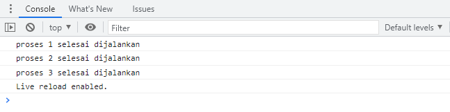

Pada kode di atas, kita bisa melihat bahwa proses1(), proses2(), dan proses3() berjalan berurutan seperti yang seharusnya. Sedangkan pada *asynchronous* yang biasa dikenal juga dengan sebutan *non*-*blocking* mengizinkan komputer kita untuk memproses perintah lain sambil menunggu suatu proses lain yang sedang berlangsung. Ini artinya kita bisa melakukan lebih dari 1 proses sekaligus (*multi*-*thread*).

Contoh proses asynchronous:

    function proses1() {
        console.log("proses 1 selesai dijalankan");
    }

    function proses2() {
        // setTimeout or delay for *asynchronous* simulation
        setTimeout(function () {
            console.log("proses 2 selesai dijalankan");
        }, 100);
    }

    function proses3() {
        console.log("proses 3 selesai dijalankan");
    }

    proses1();
    proses2();
    proses3();

Tampilan di console:

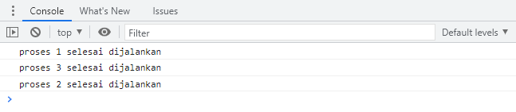

Pada hasil output di atas kita bisa lihat bahwa proses3() selesai terlebih dahulu dibanding proses2(). Hal ini terjadi dikarenakan proses2() melakukan **setTimeout()** yang merupakan proses *asynchronous* sehingga proses3() selesai terlebih dibanding proses2().

**Menggunakan *Callback***

Kita akan coba memperbaiki *asynchronous* di atas dengan memastikan *output* proses1, proses2, dan proses3 sesuai urutan dengan menggunakan *callback*.

    function proses1() {
        console.log("proses 1 selesai dijalankan");
    }

    function proses2(callback) {
        setTimeout(function () {
            console.log("proses 2 selesai dijalankan");
            callback();
        }, 100);
    }

    function proses3() {
        console.log("proses 3 selesai dijalankan");
    }
    proses1();
    proses2(proses3);

Hasil *output* di console:

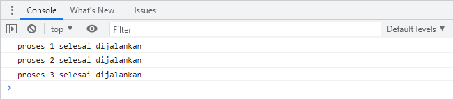

Analogi kasus di atas adalah bayangkan kamu memiliki *method* yang melakukan proses menampilkan *image* lalu kita memerlukan *callback* untuk memastikan proses menampilkan *image* terpanggil terlebih dahulu sebelum menampilkan ke *user* yang ingin mengaksesnya. Jadi *callback* dapat digunakan untuk mengatur order function yang harus berjalan terlebih dahulu.

**Membuat *callback function***

Kita dapat memanggil callback pada sebuah function dengan cara memanggilnya ke dalam parameter dan digunakan di dalam function. Langkah-langkahnya sebagai berikut:

1. Deklarasikan dahulu **function greeting(name)** yang ingin kita panggil dalam *callback function* lain. **Function greeting(name)** berisi **console.log()** yang menerima sebuah parameter **name**.

        function greeting(name) {
            console.log("Halo " + (name) + ", selamat datang di Skilvul!");
        }

2. buat sebuah **function introduction(firstName, lastName, callback)** dengan menerima parameter **firstName**, **lastName** dan **callback** lalu di dalam **function** tersebut kita menggabungkan parameter **firstName** dan **lastName** ke dalam variabel **fullName** untuk mengirimkannya ke dalam *callback*.

        function introduction(firstName, lastName, callback) {
            const fullName = (firstName) + (lastName);

            callback(fullName);
        }

        introduction("Ahmad", "Fauzul", greeting); 

    Hasil *output* di console:

    

3. Dalam pemanggilan **function introduction**, kita mengisi argumen dari parameter yang dibutuhkan yaitu Ahmad, Fauzul, dan **function greeting** yang sudah kita buat sebelumnya lalu kita panggil **callback(fullName)** di dalam **function introduction** sehingga kita bisa mendapatkan hasil dari **function greeting**.

### *Promise*
*Promise* adalah salah satu fitur dari ES6 (ES2015) JavaScript. Konsep *promise* hadir untuk memecahkan masalah yang bertele-tele dengan *callback*, semakin banyak kita menggunakan *callback* untuk proses *asynchronous* semakin kompleks dan sulit kode kita untuk dibaca dan dipelihara.

**Konsep *Promise***

*Promise* sesuai dengan artinya adalah janji. Seperti ketika kita berjanji, jika apa yang kita janjikan bisa kita lakukan maka kita harus melakukannya, jika janjinya ada halangan maka kita tidak bisa melakukannya atau jika janji tersebut belum pada waktunya kita juga harus menunggunya.

**3 Status *Promise* di JavaScript**

Analogi dari sebuah *promise* di JavaScript itu sama seperti kita saat mengambil suatu data baik itu dari database maupun *Request* API. Akan ada 3 kondisi yaitu data sedang diproses, data berhasil didapatkan, atau data gagal didapatkan.

- **pending**, jika data sedang diproses.
- **fulfilled**, jika data telah berhasil didapatkan.
- **rejected**, jika data gagal didapatkan.

**Contoh menggunakan *promise***

    let newPromise = new Promise((resolve, reject) => {
        if (true) {
            // apa yang dilakukan jika promise fulfilled
            resolve("Berhasil");
        } else {
            // apa yang dilakukan jika promise rejected
            reject("Gagal");
        }
    });

Kita bisa membuat sendiri apa yang akan dilakukan pada sebuah *promise*. Di dalam *promise* ada 2 *keyword* yaitu **resolve()** (jika proses berhasil atau *fullfilled*) dan **reject()** (jika proses gagal atau *rejected*).

**Contoh penggunaan *promise fullfilled***

Untuk *fulfilled* hanya bisa tereksekusi jika kita kondisi berhasil pada saat kita melakukan *async*. Kita *set condition* menjadi *true* untuk simulasi *fulfilled*.

    const condition = true;

    let newPromise = new Promise((resolve, reject) => {
        if (condition) {
            // apa yang dilakukan jika promise 'fulfilled'
            resolve("Berhasil");
        } else {
            // apa yang dilakukan jika promise 'rejected'
            reject(new Error("Error Gagal"));
        }
    });

Untuk bisa mengeksekusi promise yang sudah dibuat kita bisa memanggil promise tersebut menggunakan **.then()**:

    const condition = true;

    let newPromise = new Promise((resolve, reject) => {
        if (condition) {
            // apa yang dilakukan jika promise 'fulfilled'
            resolve("Berhasil");
        } else {
            // apa yang dilakukan jika promise 'rejected'
            reject(new Error("Error Gagal"));
        }
    });

    newPromise.then((result) => {
        console.log(result);
    });

Hasil *output* di console:

Selain itu kita juga bisa memanggil **.then()** lebih dari satu kali ketika dibutuhkan.

Contoh:

    const condition = true;

    let newPromise = new Promise((resolve, reject) => {
        if (condition) {
            // apa yang dilakukan jika promise 'fulfilled'
            resolve("Berhasil");
        } else {
            // apa yang dilakukan jika promise 'rejected'
            reject(new Error("Error Gagal"));
        }
    });

    newPromise.then((result) => {
        return result;
    })

    .then((result2) => {
        console.log(result2 + "!!");
    });

Hasil output di console:

**Contoh penggunaan *promise rejected***

Untuk *rejected* hanya bisa tereksekusi jika kita mengalami *error* pada saat kita melakukan proses *asynchronous*. Kita *set condition* menjadi *false* untuk simulasi *rejected*.

    const condition = false;

    let newPromise = new Promise((resolve, reject) => {
        if (condition) {
            // apa yang dilakukan jika promise 'fulfilled'
            resolve("Berhasil");
        } else {
            // apa yang dilakukan jika promise 'rejected'
            reject(new Error("Error Gagal"));
        }
    });

Hasil *output* di console:

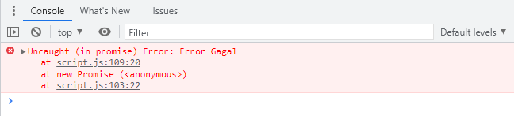

Untuk bisa mengantisipasi jika terjadi *error* kita bisa menambahkan **.catch()** pada *promise*. Sehingga, kita bisa memberi tahu pengguna jika terjadi suatu *error*.

    const condition = false;

    let newPromise = new Promise((resolve, reject) => {
        if (condition) {
            // apa yang dilakukan jika promise 'fulfilled'
            resolve("Berhasil");
        } else {
            // apa yang dilakukan jika promise 'rejected'
            reject(new Error("Error Gagal"));
        }
    });

    newPromise.then((result) => {
        console.log(result);
    })

    .catch((error) => {
        console.log(error.message); //
    });

Hasil *output* di console:

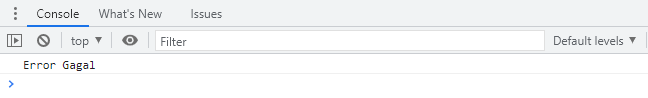

Selain **.then()** dan **.catch()**, dalam *promise* kita juga memiliki **.finally()** dalam *promise* JavaScript. **.finally()** adalah fungsi *callback* yang pasti tereksekusi dalam kondisi apapun (**fullfield** ataupun **rejected**).

    const condition = true;

    let newPromise = new Promise((resolve, reject) => {
        if (condition) {
            // apa yang dilakukan jika promise 'fulfilled'
            resolve("Berhasil");
        } else {
            // apa yang dilakukan jika promise 'rejected'
            reject(new Error("Error Gagal"));
        }
    });

    newPromise
    .then((result) => {
        console.log(result); // Output: Berhasil
    })
    .catch((error) => {
        console.log(error);
    })
    .finally(() => {
        console.log("Finally tetap terpanggil dalam kondisi fulfilled ataupun rejected");
    });

Hasil *output* di console:

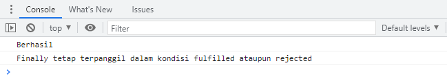

### *Promise Instance*
Pada banyak kasus biasanya kita dapat menggunakan *promise instance* seperti **.then()**, **.catch()**, dan **.finally()** untuk mengantisipasi *response* saat kita melakukan *request* ke *server*.

Berikut contoh  penggunaan *promise instance* untuk proses mengambil data API dari https://jsonplaceholder.typicode.com/ :

    fetch("https://jsonplaceholder.typicode.com/users")
    .then((response) => response.json()) // Jika data berhasil didapatkan

    .then((json) => console.log(json))
    .catch((error) => console.log(error)) // Jika data tidak berhasil didapatkan
  
    .finally(() => {
        console.log("Finally tetap terpanggil dalam kondisi fulfilled ataupun rejected"); // Finally tetap terpanggil dalam kondisi fulfilled ataupun rejected
    });

Hasil *output* di console:

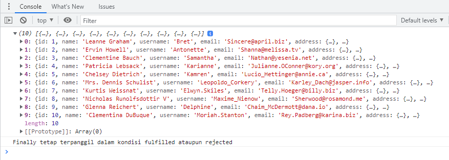

Dari kode di atas, kita dapat mengetahui bahwa:
1. **.then()** digunakan untuk mengantisipasi keadaan *fulfilled*, setelah *response* didapatkan dan menampilkan data *array of object* dari *server*.
2. **.catch()** digunakan untuk mengantisipasi keadaan *rejected*, jika *response* gagal didapatkan atau terdapat *error* lain dari *server*, lantas apa yang ingin kita lakukan pada aplikasi? Menampilkan page error? Atau menampilkan alert?
3. **.finally()** digunakan untuk mengantisipasi apa yang akan aplikasi lakukan saat *response* berhasil ataupun gagal didapatkan. Namun, penggunaan **.finally()** biasanya jarang dilakukan.

### *Async*/*await*
*Async*/*await* baru ada ketika update ES8 JavaScript dan dibangun menggunakan *promise*. Jadi sebenarnya *async*/*await* dan *promise* itu sama saja, namun hanya berbeda dari *syntax* dan cara penggunaannya. Sebuah *async function* bisa tidak berisi *await* sama sekali atau lebih dari satu *await*. *Keyword await* hanya bisa digunakan didalam *async function*, jika digunakan di luar *async function* maka akan terjadi error.

***Async***

*Async*, mengubah *function synchronous* menjadi *asynchronous*.

Berikut ini contoh penggunaan dari async :

    // async menggunakan keyword function 
    async function tesAsyncAwait() {
        return "Fulfilled";
    }

    console.log(tesAsyncAwait());

    // async menggunakan arrow function
    const tesAsyncAwait = async () => {
        return "Fulfilled";
    };

    console.log(tesAsyncAwait());

Jika salah satu kode di atas dijalankan, maka akan terlihat hasil *output* do console seperti berikut ini:

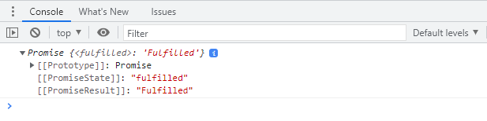

***Await***

*Await* hanya bisa digunakan dalam *async function* dan *await* adalah *keyword* dalam *async* yang digunakan untuk menunda hingga proses *asynchronous* selesai.

Berikut contoh penggunaan dari *async*/*await*:

    async function tesAsyncAwait() {
        await 'Fulfilled';
    }

Kita juga bisa memberikan *error handling* pada *async*/*await*. Berikut contoh lengkap penggunaan *async*/*await*:

    // Definisikan dahulu promise yang ingin digunakan
    let condition = true;
    let tesAsyncAwait = async (condition) => {
        if (condition) {
            return "Condition is fulfilled!";
        } else {
            throw "Condition is rejected!";
        }
    };

    // Membuat fungsi run menjadi asynchronous menggunakan async/await
    const run = async (condition) => {
        try {
            const message = await tesAsyncAwait(condition);
            console.log(message);  // Output: Condition is fulfilled!
            console.log("After condition is fulfilled"); // Output: After condition is fulfilled
        } catch (error) {
            console.log(error);
        }
    };

    run(true);

Dari kode di atas, kita dapat melihat bahwa *run* adalah sebuah fungsi *async* dan *await* dipanggil bersamaan dengan fungsi **tesAsyncAwait(condition)**. **Await** pada fungsi ini artinya, **console.log** pada *message* dan **After condition is fulfilled** tidak akan dijalankan (ditunda) hingga proses **tesAsyncAwait(condition)** selesai dijalankan.

Hasil *output* di console:

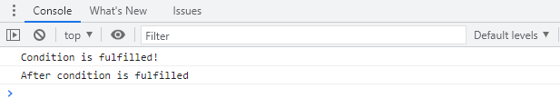

Berikut merupakan contoh perbandingan jika program sebelumnya dibuat menggunakan *promise*:

    let condition = true;
    let tesPromise = new Promise((resolve, reject) => {
         if (condition) {
            resolve("Condition is fulfilled!");
        } else {
            reject(new Error("Condition is rejected!"));
        }
    });

    tesPromise
    .then(result =>{
        console.log(result); // Condition is fulfilled!
        console.log("After condition is fulfilled"); // After condition is fulfilled
    })
    .catch(error =>{
        console.log(error);
    })

Hasil *output* di console:

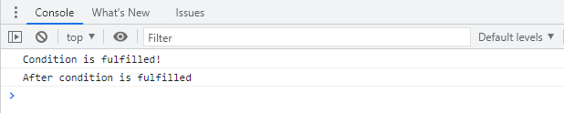

### *Fetch*
Dalam JavaScript kita bisa mengirimkan *network request* dan juga bisa mengambil informasi data terbaru dari *server* jika dibutuhkan. Contoh *network request* yang biasa kita lakukan adalah sebagai berikut:

- Mengirimkan data dari sebuah form.
- Mengambil data untuk ditampilkan dalam list/table.
- Mendapatkan notifikasi.

Dalam melakukan *network request*, JavaScript memiliki metode bernama **fetch()**. Proses melakukan **fetch()** adalah salah satu proses *asynchronous* di JavaScript sehingga kita perlu menggunakan salah satu di antara *promise* atau *async*/*await*.

***Fetch* dengan *Promise***

Berikut ini contoh *request* data dengan **fetch()** menggunakan *promise*:

    fetch("https://jsonplaceholder.typicode.com/posts")
    .then(function (response) {
        return response.json();
    })
    .then(function (post) {
        console.log(post);
    });

Kode di atas mengambil data end-point dari API JSONPlaceholder. Berikut hasil *output* di console:

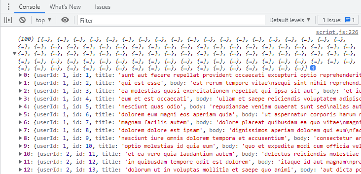

Gambar di atas merupakan data hasil *request* dari **fetch()** menggunakan *promise* yang telah dilakukan.

***Fetch* dengan *async*/*await***

Berikut contoh *request* data dengan **fetch()** menggunakan *async*/*await*:

    const tesFetchAsync = async () => {
        let response = await fetch("https://jsonplaceholder.typicode.com/posts");
        response = await response.json();
        console.log(response);
    };
    tesFetchAsync();

Kita masih mengambil data dari sumber end-point yang sama dengan fetch() sebelumnya yang menggunakan promise sehingga hasilnya pun masih sama persis seperti sebelumnya.

Hasil *output* di console:

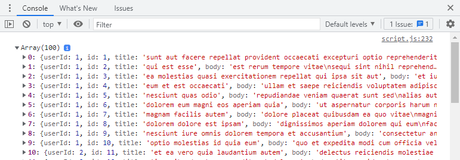

