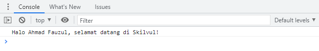

# JAVASCRIPT INTERMEDIATE
## *Asynchronous*
### *Callback*
*Callback* adalah sebuah *function*, namun bedanya dengan *function* pada umumnya adalah pada cara eksekusinya. Jika *function* pada umumnya dieksekusi secara langsung, sedangkan *callback* dieksekusi di dalam *function* lain melalui parameter. Kita akan menemukan proses *callback asynchronous* pada proses ajax, komunikasi HTTP, Operasi file, *timer* dan sebagainya.

***Synchronous* dan *Asynchronous* pada JavaScript**

Pada *synchronous output* di proses berdasarkan urutan kode.

Contoh proses synchronous:

    function proses1() {
        console.log("proses 1 selesai dijalankan");
    }

    function proses2() {
        console.log("proses 2 selesai dijalankan");
    }

    function proses3() {
        console.log("proses 3 selesai dijalankan");
    }

    proses1();
    proses2();
    proses3();

Tampilan di console:

Pada kode di atas, kita bisa melihat bahwa proses1(), proses2(), dan proses3() berjalan berurutan seperti yang seharusnya. Sedangkan pada *asynchronous* yang biasa dikenal juga dengan sebutan *non*-*blocking* mengizinkan komputer kita untuk memproses perintah lain sambil menunggu suatu proses lain yang sedang berlangsung. Ini artinya kita bisa melakukan lebih dari 1 proses sekaligus (*multi*-*thread*).

Contoh proses asynchronous:

    function proses1() {
        console.log("proses 1 selesai dijalankan");
    }

    function proses2() {
        // setTimeout or delay for *asynchronous* simulation
        setTimeout(function () {
            console.log("proses 2 selesai dijalankan");
        }, 100);
    }

    function proses3() {
        console.log("proses 3 selesai dijalankan");
    }

    proses1();
    proses2();
    proses3();

Tampilan di console:

Pada hasil output di atas kita bisa lihat bahwa proses3() selesai terlebih dahulu dibanding proses2(). Hal ini terjadi dikarenakan proses2() melakukan **setTimeout()** yang merupakan proses *asynchronous* sehingga proses3() selesai terlebih dibanding proses2().

**Menggunakan *Callback***

Kita akan coba memperbaiki *asynchronous* di atas dengan memastikan *output* proses1, proses2, dan proses3 sesuai urutan dengan menggunakan *callback*.

    function proses1() {
        console.log("proses 1 selesai dijalankan");
    }

    function proses2(callback) {
        setTimeout(function () {
            console.log("proses 2 selesai dijalankan");
            callback();
        }, 100);
    }

    function proses3() {
        console.log("proses 3 selesai dijalankan");
    }
    proses1();
    proses2(proses3);

Hasil *output* di console:

Analogi kasus di atas adalah bayangkan kamu memiliki *method* yang melakukan proses menampilkan *image* lalu kita memerlukan *callback* untuk memastikan proses menampilkan *image* terpanggil terlebih dahulu sebelum menampilkan ke *user* yang ingin mengaksesnya. Jadi *callback* dapat digunakan untuk mengatur order function yang harus berjalan terlebih dahulu.

**Membuat *callback function***

Kita dapat memanggil callback pada sebuah function dengan cara memanggilnya ke dalam parameter dan digunakan di dalam function. Langkah-langkahnya sebagai berikut:

1. Deklarasikan dahulu **function greeting(name)** yang ingin kita panggil dalam *callback function* lain. **Function greeting(name)** berisi **console.log()** yang menerima sebuah parameter **name**.

        function greeting(name) {
            console.log("Halo " + (name) + ", selamat datang di Skilvul!");
        }

2. buat sebuah **function introduction(firstName, lastName, callback)** dengan menerima parameter **firstName**, **lastName** dan **callback** lalu di dalam **function** tersebut kita menggabungkan parameter **firstName** dan **lastName** ke dalam variabel **fullName** untuk mengirimkannya ke dalam *callback*.

        function introduction(firstName, lastName, callback) {
            const fullName = (firstName) + (lastName);

            callback(fullName);
        }

        introduction("Ahmad", "Fauzul", greeting); 

    Hasil *output* di console:

    

3. Dalam pemanggilan **function introduction**, kita mengisi argumen dari parameter yang dibutuhkan yaitu Ahmad, Fauzul, dan **function greeting** yang sudah kita buat sebelumnya lalu kita panggil **callback(fullName)** di dalam **function introduction** sehingga kita bisa mendapatkan hasil dari **function greeting**.
